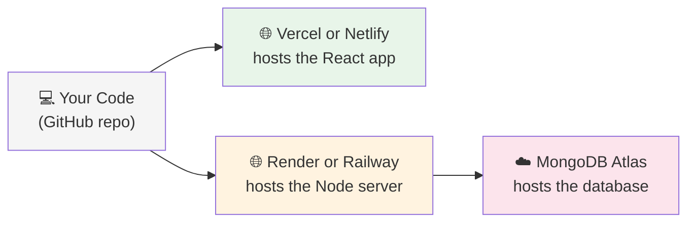

# Expense Tracker

A full-stack MERN app to add, view, filter, and delete expenses, with category-wise totals.

## Tech Stack
- MongoDB
- Express.js
- React
- Node.js

## How It's Deployed

```mermaid

   
## What Happens When You Add an Expense

```mermaid
sequenceDiagram
    participant You
    participant App as React App
    participant Server
    participant DB as Database

    You->>App: Fill the form, hit Submit
    App->>Server: "Here's a new expense"
    Server->>Server: Checks if it's valid
    alt Looks good
        Server->>DB: Save it
        DB-->>Server: Saved!
        Server-->>App: "Done, here's the saved expense"
        App-->>You: Form clears, list updates
    else Something's wrong
        Server-->>App: "Nope, here's why"
        App-->>You: Shows an error message
    end
```

## Where Everything Lives



## Setup

1. Clone the repo
2. Run `npm install` in both `client/` and `server/`
3. Add a `.env` file in `server/` with your `MONGO_URI`
4. Run the server: `npm start` (inside `server/`)
5. Run the client: `npm run dev` (inside `client/`)
